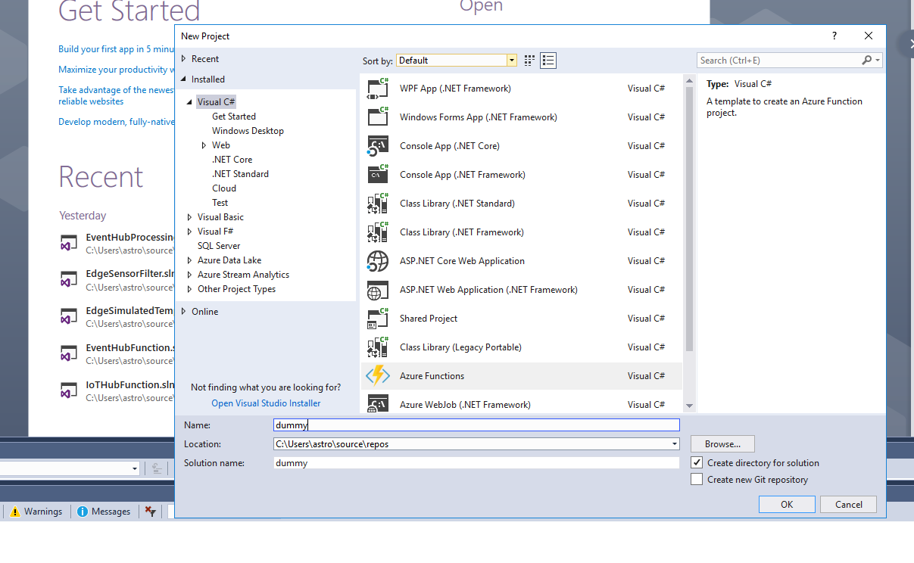
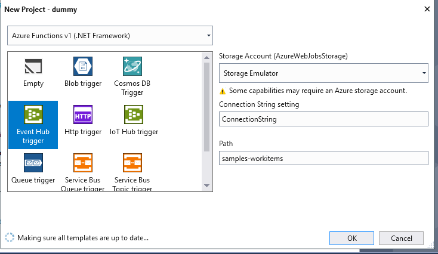
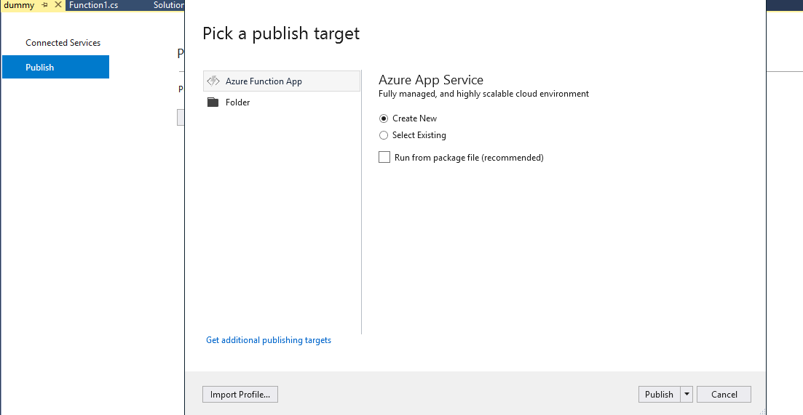
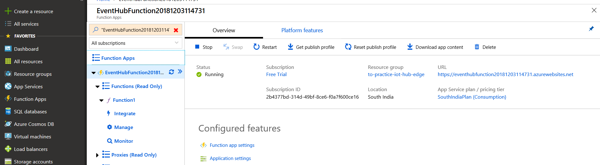
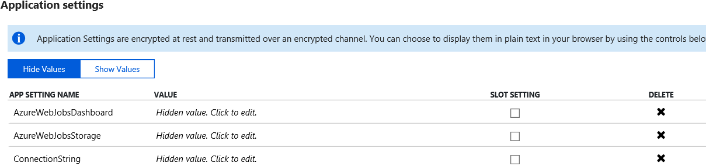

# toAzureEventsHubCosmosDBFunction
## Goal
To run a azure function which monitors for events from IoT hub to trigger the function of pushing data to Cosmoss DB

## What is the difference between non azure function https://github.com/SURAJTHEGREAT/toAzureEventsHubCosmosDB and azure function?

In the previous project , we need to run manually the VISUAL STUDIO solution to execute the functionality of pushing events to cosmoss DB.
Here the azure function acts as webhook listening for events. No manual action required.

## Development Language 
 C# AZURE FUNCTION

## Step by Step instruction

# To test locally
1. Install azure function extension in visual basic
2. Create New -> Project -> Azure function project 

3. Select Event Hub Trigger and give the Connection String in Settings as "ConnectionString"

4. In local.settings.json - create a new key, value pair (ConnectionString and provide corresponding event hub connection taken from IoT hub
-> Build in endpoints

5. Git clone and copy the project code accordingly
6. Execute CNTRL + F5 in local machine to check if events are stored in cosmoss DB.

## To publish azure function in Cloud
1. Right click our solution and select publish

2. Fill in all the details as in prompt to publish your function

3. Check if the function is created in azure portal

4. Provide your Connection String in application settings and restart the function

5. Check if data is stored in collection.

## Dependend repositories

1. https://github.com/SURAJTHEGREAT/toAzureEventsHubCosmosDB
2. https://github.com/SURAJTHEGREAT/azureEdgeSensorFilter
3. https://github.com/SURAJTHEGREAT/azureIotEdgeTempSensor
